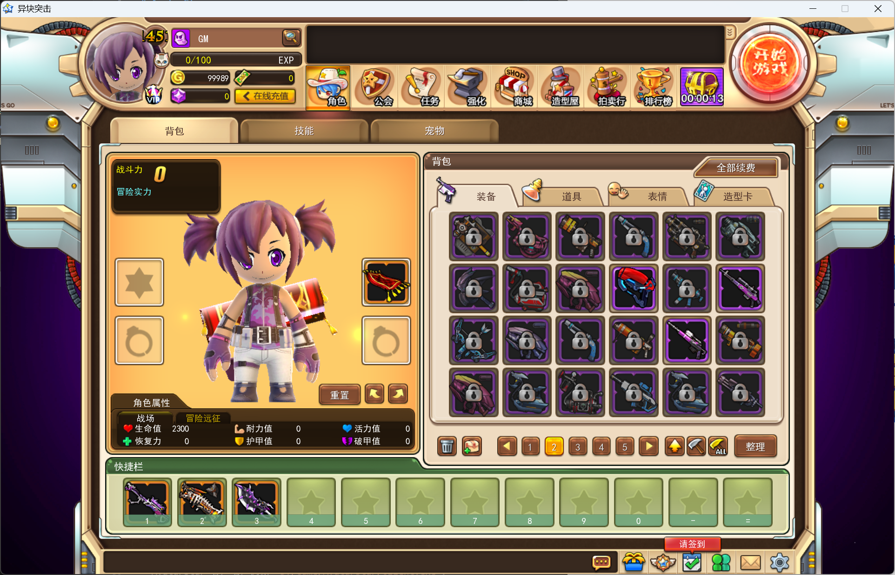
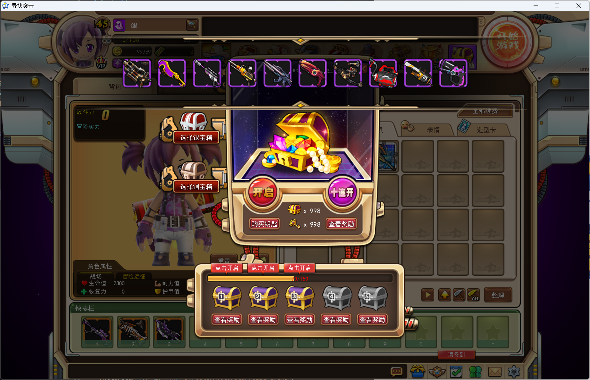
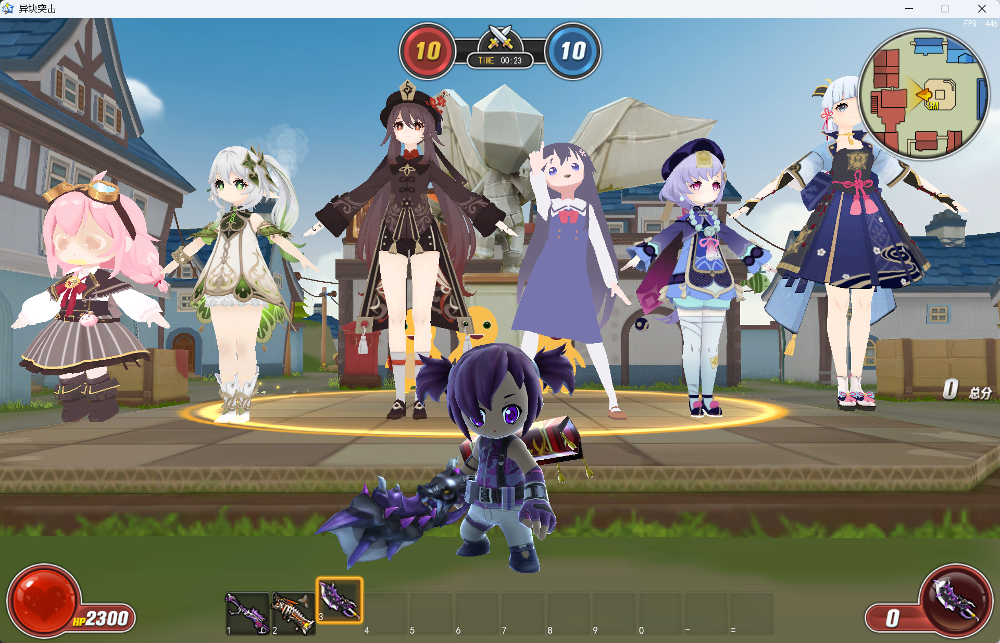

# AvatarStar


基于 Codex 实现的AvatarStar后端逻辑

---





# 本地启动指南

本文档说明如何从零创建 MySQL 数据库、配置服务端、初始化数据表、准备登录 token，并启动 AvatarStar 客户端进入游戏。流程以 Windows + PowerShell + MySQL 8.0 + .NET 8 SDK 为基准。

## 项目结构

```text
AvatarStar/
├─ run_game.bat
├─ src/
│  ├─ AvatarStar.sln
│  ├─ AvatarStar.Server/
│  │  └─ Database/                  # MySQL 连接、账号、token 哈希等公共逻辑
│  ├─ AvatarStar.Server.Login/       # 登录服，监听 TCP 9531
│  ├─ AvatarStar.Server.Game/        # 游戏服，监听 TCP/UDP 9532，房间 channel 默认 9533
│  └─ AvatarStar.Tools.PdeUnpacker/  # PDE 解包工具
├─ docs/
└─ tools/
```

核心启动链路：

1. 创建 MySQL 数据库和账号。
2. 设置 `AS_MYSQL_CONNECTION_STRING`。
3. 编译服务端。
4. 启动游戏服，服务端自动建表。
5. 准备可用 token。
6. 使用 `client.exe -ip 127.0.0.1 -port 9532 -token <token>` 启动客户端。

## 前置要求

- Windows 10/11。
- .NET 8 SDK。
- MySQL 8.0，或兼容 `JSON` 字段的 MySQL/MariaDB。
- AvatarStar 客户端，例如 `D:/Game/AvatarStar/client.exe`。

验证 .NET：

```powershell
dotnet --info
```

验证 MySQL 命令行可用：

```powershell
mysql --version
```

## 1. 创建数据库

以 MySQL root 或具备建库权限的账号登录：

```powershell
mysql -u root -p
```

执行以下 SQL：

```sql
CREATE DATABASE IF NOT EXISTS avatarstar
  CHARACTER SET utf8mb4
  COLLATE utf8mb4_unicode_ci;

CREATE USER IF NOT EXISTS 'avatarstar'@'localhost'
  IDENTIFIED BY 'AvatarStar123';

CREATE USER IF NOT EXISTS 'avatarstar'@'127.0.0.1'
  IDENTIFIED BY 'AvatarStar123';

GRANT ALL PRIVILEGES ON avatarstar.* TO 'avatarstar'@'localhost';
GRANT ALL PRIVILEGES ON avatarstar.* TO 'avatarstar'@'127.0.0.1';

FLUSH PRIVILEGES;
```

说明：

- 数据库名默认使用 `avatarstar`。
- 本地账号默认使用 `avatarstar` / `AvatarStar123!`。
- 连接串里使用 `127.0.0.1`，因此同时创建 `'avatarstar'@'127.0.0.1'`，避免 MySQL 主机匹配问题。
- 服务端代码会自动创建业务表，不需要额外导入 `.sql` 文件。

退出 MySQL：

```sql
EXIT;
```

## 2. 配置环境变量

服务端通过环境变量 `AS_MYSQL_CONNECTION_STRING` 读取 MySQL 连接串。每个启动服务端的 PowerShell 窗口都需要设置一次：

```powershell
$env:AS_MYSQL_CONNECTION_STRING="Server=127.0.0.1;Port=3306;Database=avatarstar;User ID=avatarstar;Password=AvatarStar123;SslMode=None;AllowPublicKeyRetrieval=True"
$env:AS_REPO_ROOT="你的项目路径"
```

连接串字段说明：

- `Server=127.0.0.1`：MySQL 地址。
- `Port=3306`：MySQL 默认端口。
- `Database=avatarstar`：第 1 步创建的数据库。
- `User ID=avatarstar` / `Password=AvatarStar123`：第 1 步创建的账号。
- `SslMode=None`：本地开发关闭 SSL。
- `AllowPublicKeyRetrieval=True`：兼容 MySQL 8 默认认证方式。

可选：如果不想每次打开终端都重新设置，可以写入当前 Windows 用户环境变量。执行后需要重新打开 PowerShell：

```powershell
setx AS_MYSQL_CONNECTION_STRING "Server=127.0.0.1;Port=3306;Database=avatarstar;User ID=avatarstar;Password=AvatarStar123;SslMode=None;AllowPublicKeyRetrieval=True"
setx AS_REPO_ROOT "你的项目路径"
```

## 3. 编译服务端

进入仓库根目录：

```powershell
cd "你的项目路径"
```

还原并编译解决方案：

```powershell
dotnet restore "src/AvatarStar.sln"
dotnet build "src/AvatarStar.sln" -c Debug
```

成功后，`AvatarStar.Server.Game` 会把运行需要的配置和资源复制到输出目录，包括：

- `Config/*.json`
- `Config/SysAvatarPayloads/**`
- `Resources/*.json`
- `Resources/templates/**/*.json`
- `tools/resources/*.json`

## 4. 启动游戏服并自动建表

打开一个新的 PowerShell，设置环境变量：

```powershell
$env:AS_MYSQL_CONNECTION_STRING="Server=127.0.0.1;Port=3306;Database=avatarstar;User ID=avatarstar;Password=AvatarStar123;SslMode=None;AllowPublicKeyRetrieval=True"
$env:AS_REPO_ROOT="你的项目路径"
```

启动游戏服：

```powershell
cd "你的项目路径"
dotnet run --project "src/AvatarStar.Server.Game/AvatarStar.Server.Game.csproj"
```

看到类似日志表示启动成功：

```text
MySQL game data schema initialized
Listening on *:9532
Listening (UDP) on *:9532
Practice-room channel listening on *:9533
Practice-room UDP channel listening on *:9533
```

游戏服启动时会自动创建以下表：

```text
accounts
auth_tokens
game_player_profiles
game_characters
game_inventory_items
```

可以在 MySQL 中验证：

```powershell
mysql -u avatarstar -p -h 127.0.0.1 avatarstar
```

```sql
SHOW TABLES;
```

## 5. 准备客户端 token

游戏服当前要求 token 登录。`run_game.bat` 中的 `as_local_test_token` 只有写入数据库后才有效。

### 方案 A：手动创建本地开发 token

这是最直接的本地启动方式。进入 MySQL：

```powershell
mysql -u avatarstar -p -h 127.0.0.1 avatarstar
```

写入一个本地账号和固定 token：

```sql
SET @token := 'as_local_test_token';

INSERT INTO accounts (username, password_hash, created_at, updated_at)
VALUES ('local', 'manual_token_only', UTC_TIMESTAMP(6), UTC_TIMESTAMP(6))
ON DUPLICATE KEY UPDATE
  updated_at = UTC_TIMESTAMP(6);

SET @account_id := (
  SELECT id
  FROM accounts
  WHERE username = 'local'
  LIMIT 1
);

INSERT INTO auth_tokens (account_id, token_hash, expires_at, created_at)
VALUES (
  @account_id,
  LOWER(SHA2(@token, 256)),
  DATE_ADD(UTC_TIMESTAMP(6), INTERVAL 12 HOUR),
  UTC_TIMESTAMP(6)
)
ON DUPLICATE KEY UPDATE
  account_id = VALUES(account_id),
  expires_at = VALUES(expires_at),
  revoked_at = NULL;
```

说明：

- `token_hash` 必须是 token 的 SHA-256 小写十六进制哈希。
- `expires_at` 默认设置为 12 小时后，过期后重新执行这段 SQL 即可刷新。
- 这个账号主要用于直连游戏服；`password_hash` 是占位值，不能用于正常密码登录。

### 方案 B：通过登录服注册账号

登录服会创建账号并返回 token。启动方式：

```powershell
cd "你的项目路径"
$env:AS_MYSQL_CONNECTION_STRING="Server=127.0.0.1;Port=3306;Database=avatarstar;User ID=avatarstar;Password=AvatarStar123;SslMode=None;AllowPublicKeyRetrieval=True"
dotnet run --project "src/AvatarStar.Server.Login/AvatarStar.Server.Login.csproj"
```

登录服监听：

```text
TCP 9531
```

注意：当前 `src/AvatarStar.Server.Login/ServerManager.cs` 中服务器列表端口仍是占位值 `1234`。因此本地稳定跑通推荐使用方案 A 准备 token，然后通过 `-ip 127.0.0.1 -port 9532 -token <token>` 直连游戏服。

## 6. 启动客户端进入游戏

确认游戏服窗口仍在运行，然后启动客户端。

如果客户端路径是 `D:/Game/AvatarStar/client.exe`，可以直接运行仓库里的脚本：

```powershell
cd "你的项目路径"
./run_game.bat
```

`run_game.bat` 当前内容：

```bat
"D:\Game\AvatarStar\client.exe" -ip 127.0.0.1 -port 9532 -token as_local_test_token -title AvatarStar -local zh_cn
```

如果客户端安装在其他目录，修改脚本中的路径，或直接执行：

```powershell
& "D:/Game/AvatarStar/client.exe" -ip 127.0.0.1 -port 9532 -token as_local_test_token -title AvatarStar -local zh_cn
```

参数说明：

- `-ip 127.0.0.1`：连接本机游戏服。
- `-port 9532`：游戏服 TCP/UDP 端口。
- `-token as_local_test_token`：第 5 步写入数据库的 token。
- `-title AvatarStar`：窗口标题。
- `-local zh_cn`：客户端语言/本地化参数。

首次进入账号后，按客户端流程创建角色。角色、背包和账号快照会保存到 MySQL：

- `game_player_profiles`：账号整体快照 JSON。
- `game_characters`：角色索引数据，角色名有唯一索引。
- `game_inventory_items`：背包物品索引数据。

## 7. 常用端口

| 服务                  | 协议 | 默认端口 | 说明                 |
| --------------------- | ---- | -------: | -------------------- |
| MySQL                 | TCP  |     3306 | 数据库               |
| Login Server          | TCP  |     9531 | 登录服               |
| Game Server           | TCP  |     9532 | 主游戏连接           |
| Game Server           | UDP  |     9532 | UDP 会话             |
| Practice Room Channel | TCP  |     9533 | 练习房间 channel     |
| Practice Room Channel | UDP  |     9533 | 练习房间 UDP channel |

默认情况下游戏服同时启用 TCP 和 UDP。可用以下环境变量调整：

```powershell
$env:AS_GAME_TCP="1"
$env:AS_GAME_UDP="1"
$env:AS_CHANNEL_PORT="9533"
$env:AS_CHANNEL_HOST="127.0.0.1"
```

## 8. 常见问题

### `MySQL connection string is missing`

当前终端没有设置 `AS_MYSQL_CONNECTION_STRING`。在启动 `dotnet run` 的同一个 PowerShell 窗口执行：

```powershell
$env:AS_MYSQL_CONNECTION_STRING="Server=127.0.0.1;Port=3306;Database=avatarstar;User ID=avatarstar;Password=AvatarStar123;SslMode=None;AllowPublicKeyRetrieval=True"
```

### `Access denied for user 'avatarstar'`

检查数据库账号和授权：

```sql
SELECT User, Host FROM mysql.user WHERE User = 'avatarstar';
SHOW GRANTS FOR 'avatarstar'@'127.0.0.1';
```

必要时重新执行第 1 步的 `CREATE USER` 和 `GRANT`。

### `Invalid token`

原因通常是 token 未写入、token 写错、哈希不匹配或已过期。重新执行第 5 步方案 A 的 SQL，然后重启客户端。

### 端口占用

如果 `9532` 或 `9533` 被占用，先关闭旧的服务端进程。检查端口：

```powershell
netstat -ano | findstr ":9532"
netstat -ano | findstr ":9533"
```

`9533` 可以通过 `AS_CHANNEL_PORT` 改；`9532` 当前在代码中固定，修改前需要同步客户端启动参数。

### 客户端路径错误

`run_game.bat` 默认写死：

```bat
"D:\Game\AvatarStar\client.exe"
```

如果你的客户端不在这个位置，请改成实际路径。

### 登录服服务器列表无法进入游戏

`AvatarStar.Server.Login` 可以处理登录/注册和 token 发放，但 `ServerManager.cs` 中返回的服务器端口目前是占位值 `1234`。本地启动建议绕过服务器列表，使用 `run_game.bat` 直连 `127.0.0.1:9532`。

## 9. 最小跑通清单

```powershell
# 1. 建库后，在一个 PowerShell 窗口启动游戏服
cd "你的项目路径"
$env:AS_MYSQL_CONNECTION_STRING="Server=127.0.0.1;Port=3306;Database=avatarstar;User ID=avatarstar;Password=AvatarStar123;SslMode=None;AllowPublicKeyRetrieval=True"
$env:AS_REPO_ROOT="C:/Users/33735/Desktop/CXBT/AvatarStarCBT-master"
dotnet run --project "src/AvatarStar.Server.Game/AvatarStar.Server.Game.csproj"
```

```sql
-- 2. 在 MySQL 中写入开发 token
SET @token := 'as_local_test_token';

INSERT INTO accounts (username, password_hash, created_at, updated_at)
VALUES ('local', 'manual_token_only', UTC_TIMESTAMP(6), UTC_TIMESTAMP(6))
ON DUPLICATE KEY UPDATE updated_at = UTC_TIMESTAMP(6);

SET @account_id := (SELECT id FROM accounts WHERE username = 'local' LIMIT 1);

INSERT INTO auth_tokens (account_id, token_hash, expires_at, created_at)
VALUES (@account_id, LOWER(SHA2(@token, 256)), DATE_ADD(UTC_TIMESTAMP(6), INTERVAL 12 HOUR), UTC_TIMESTAMP(6))
ON DUPLICATE KEY UPDATE
  account_id = VALUES(account_id),
  expires_at = VALUES(expires_at),
  revoked_at = NULL;
```

```powershell
# 3. 启动客户端
cd "你的项目路径"
./run_game.bat
```

## 10. 维护原则

- KISS：本地启动只依赖 MySQL、.NET 8 和客户端，不引入额外启动器。
- YAGNI：没有提供未验证的一键生产部署流程，只记录当前代码实际支持的本地链路。
- DRY：数据库结构由服务端 `InitializeAsync` 统一维护，不额外复制一份 SQL 建表脚本。
- SOLID：账号、token、游戏数据分别由 `AccountRepository`、`TokenHasher`、`GameDataRepository` 负责，文档按这些边界组织操作步骤。
